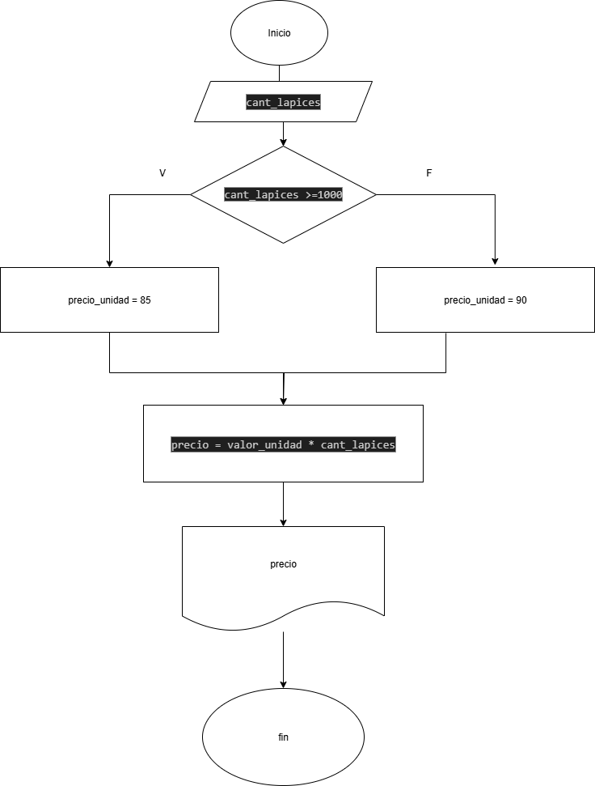

1. Realice un algoritmo para determinar cuánto se debe pagar por equis cantidad de lápices considerando que si son 1000 o más el costo es de $85 cada uno; de lo contrario, el precio es de $90. Represéntelo con el pseudocódigo y el diagrama de flujo.


## Pseudocodigo

```
Inicio
Leer cant_lapices
Si cant_lapices >=1000
    valor_unidad = 85
Si no
     valor_unidad= 90
Fin Si
precio = valor_unidad * cant_lapices
Escribir "Valor total: ", precio
Fin
```
